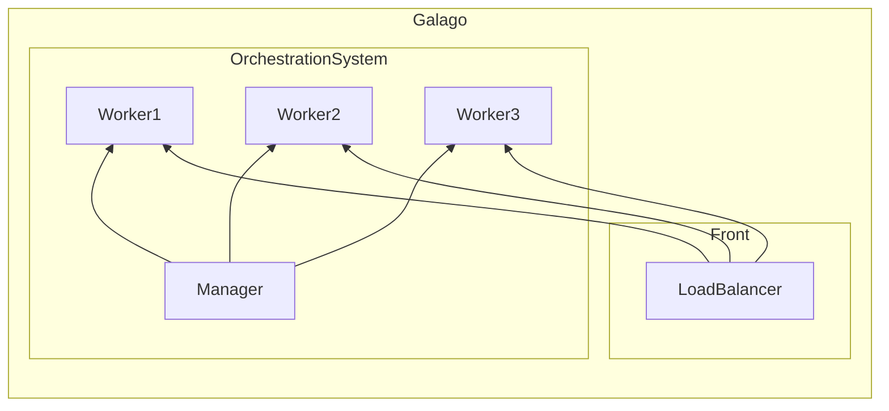

- a worker represents a physical or a virtuel machine
- a worker is the worker component of the orchestration system that runs on that machine (physical or vm)

it's the software that runs on a node

Roles:
- Run tasks as Wasm "runners" (define what is a runner => go program with runtime that load the wasm file)
- Accept tasks to run from a manager
- Provide statistics to the manager for the purpose of scheduling tasks)
- Keep track of its tasks and their state
